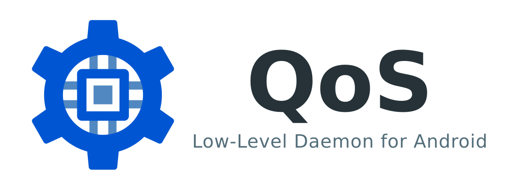

> **DISCLAIMER:** This module manipulates core kernel behavior using userspace PID loops, direct sysfs mutations, and low-level syscalls. While designed to optimize hardware resource allocation, combining this daemon with other performance modules may result in severe system instability or kernel panics. **Do With Your Own Risk, DWYOR.**
> 
> **CRITICAL REQUIREMENT:** QoS is fundamentally dependent on the **Kernel PSI, or Pressure Stall Information,** framework located at `/proc/pressure`. Devices lacking PSI support at the kernel level are strictly incompatible.

---

## Overview

QoS is a low-overhead, daemon engineered to enforce Quality of Service across Android systems. It bypasses high-level Android frameworks to operate directly against the Linux kernel, operating through a three-layer architecture:

1. **System Bootstrap & Hardening Layer in `/native`:** Written in C++. It handles low-level process hardening via strict memory page locking using `mlockall`, OOM score shielding set to `-1000`, resource limit expansion for `RLIMIT_NOFILE` and `RLIMIT_STACK`, and `SCHED_FIFO` realtime policy enforcement at Priority 50. It maximizes timer slack to `50ms`, sets Best-Effort I/O priority, clamps its own CPU utilization to a UClamp Max of 102, and strictly binds initial execution to CPU efficiency cores via topology detection.

2. **Asynchronous Event Engine in `/core`:** Written in Rust. Executes a highly efficient, non-blocking `epoll` multiplexer to dynamically manage CPU scheduling parameters, block I/O queues, and subsystem background services via direct `sysfs` mutations and PSI interrupts.

3. **Management & Telemetry Client in `/app`:** Written in Kotlin using Jetpack Compose. An optional graphical frontend utilizing Clean Architecture. It interfaces with the daemon via privileged root shell execution to provide real-time telemetry and dynamic configuration management.

### System Architecture

```mermaid
%%{
	init:{
		'theme':'dark',
		'themeVariables':{
			'primaryColor':'#2a2a2a',
			'primaryBorderColor':'#ffffff',
			'primaryTextColor':'#ffffff',
			'lineColor':'#cccccc',
			'clusterBkg':'#1a1a1a',
			'clusterBorder':'#ffffff',
			'edgeLabelBackground':'#2a2a2a',
			'fontSize':'11px',
			'fontFamily':'monospace'
		}
	}
}%%

graph TD

subgraph SYSTEM["ANDROID OS & KERNEL ENVIRONMENT"]
	direction TB
	K_PSI_C["PSI Node (CPU)"]
	K_PSI_I["PSI Node (I/O)"]
	K_SYS["Sysfs & Hardware Nodes"]
	K_VFS["Virtual File System (VFS)"]
	K_FS["Data & Cache Filesystem"]
	K_PROC["Process Descriptor (FD) Info"]
	K_SIG["OS Signal Emitter"]
	A_PROP["Android System Properties"]
	A_PM["Package Manager Service"]
end

subgraph DAEMON["DAEMON"]

	subgraph NATIVE["RUNTIME"]
		style NATIVE fill:#2d2d2d,stroke:#ffffff,stroke-width:2px,color:#ffffff

		N_MAIN["Daemon Entry Point"] --> N_CRASH["Crash & Signal Handler"]
		N_CRASH --> N_TUNER["OOM & Hardener"]
		N_TUNER --> N_DETECT["Kernel Feature Detector"]
		N_DETECT --> N_CONF["Config Parser"]
		N_CONF --> N_BRIDGE["FFI Bridge"]
	end

	subgraph CORE["CORE ENGINE"]
		style CORE fill:#1a1a1a,stroke:#ffffff,stroke-width:2px,color:#ffffff

		R_ENTRY["Entry Point"]
		N_BRIDGE ==> R_ENTRY

		subgraph BOOT_WORKER["BOOTSTRAP WORKER"]
			style BOOT_WORKER fill:#222222,stroke-dasharray:5 5,stroke:#ffffff,color:#ffffff

			W_TWEAK["System Tweaker Thread<br/>(One-time execution)"]
		end

		R_ENTRY -.-> W_TWEAK
		W_TWEAK -->|Hardware Probing| K_SYS
		W_TWEAK -->|Apply Tunables| H_PROP

		subgraph MAIN["MAIN EVENT LOOP"]
			style MAIN fill:#252526,stroke:#ffffff,color:#ffffff

			EPOLL["Epoll Multiplexer"]

			S_CTX{{"Shared Pressure Context"}}
			S_SHUT{{"Thread-Safe Lifecycle State"}}

			subgraph LIFECYCLE["RECOVERABLE SERVICE MANAGER"]
				style LIFECYCLE fill:#2d2d2d,stroke:#ffffff,color:#ffffff

				subgraph CTRL_INT["INTERRUPT-DRIVEN"]
					C_CPU["CPU Control"]
					C_IO["Storage Control"]
					C_SIG["Signal Control"]
				end

				subgraph CTRL_TIME["TIMEOUT-DRIVEN"]
					C_CLN["Cleaner Control"]
					C_BLK["Blocker Control"]
				end
			end

			EPOLL <==>|OS Interrupts| CTRL_INT
			EPOLL -.->|Scheduled Wakeups| CTRL_TIME

			C_SIG -->|Flag Shutdown| S_SHUT
			EPOLL -.->|Verify State| S_SHUT

			C_IO ===>|Sync I/O State| S_CTX
			C_CPU ===>|Sync CPU State| S_CTX
			S_CTX ===>|Read I/O State| C_CPU

			subgraph LOGIC["ALGORITHMS & MATH"]
				M_KALMAN["Kalman Velocity Filter"]
				M_PID["Thermal Math (PID/Smith)"]
				M_MATH["Load & Queue Math"]
				M_POLL["Adaptive Poller"]
			end

			subgraph HAL["HARDWARE ABSTRACTION LAYER"]
				H_PSI_C["CPU PSI Monitor"]
				H_PSI_I["I/O PSI Monitor"]
				H_DISK["Disk Status Monitor"]
				H_T_CPU["CPU Thermal Sensor"]
				H_T_BAT["Battery Thermal Sensor"]
				H_SYSFS["Sysfs Writer/Cache"]
				H_PROP["Properties Interface"]
				H_TRAV["Secure Path Resolver"]
			end

			C_CPU --> H_PSI_C & H_T_CPU & H_T_BAT & M_PID & M_MATH & M_POLL & H_SYSFS
			C_IO --> H_PSI_I & H_DISK & M_MATH & M_POLL & H_SYSFS
			C_CLN --> H_PSI_C & H_PSI_I & H_T_BAT
			C_CLN -.->|Direct OS Query| K_VFS
		end

		subgraph BACKGROUND["BACKGROUND WORKERS"]
			style BACKGROUND fill:#222222,stroke-dasharray:5 5,stroke:#ffffff,color:#ffffff

			W_CLN["Cleaner Worker<br/>(Async Channel)"]
			W_BLK["Blocker Worker<br/>(Ephemeral Thread)"]
		end

		C_CLN -.->|Dispatch Event| W_CLN
		C_BLK -.->|Spawn Task| W_BLK
	end
end

H_PSI_C & H_PSI_I --> M_KALMAN
W_CLN --> H_TRAV
H_TRAV --> K_PROC & K_FS

K_PSI_C -.-> EPOLL
K_PSI_I -.-> EPOLL
K_SIG -.-> EPOLL

H_PSI_C --> K_PSI_C
H_PSI_I --> K_PSI_I

H_DISK & H_T_CPU & H_T_BAT & H_SYSFS --> K_SYS
H_PROP --> A_PROP
W_BLK --> A_PM
```

---

## Technical Capabilities

* **Dynamic CPU Governor:** Modulates core scheduling tunables including `latency_ns`, `min_granularity_ns`, `wakeup_granularity_ns`, `migration_cost_ns`, `walt_init_task_load_pct`, and `uclamp_util_min`. Calculations are driven by `/proc/pressure/cpu` trends, utilizing pressure velocity, integral tracking, and thermal scaling derived from native battery and CPU temperature sensors.

* **Storage I/O Tuning:** Features a dual-layer optimization engine. Statically, it detects storage types such as NVMe, UFS, eMMC, and Rotational to assign optimal I/O schedulers like `kyber`, `mq-deadline`, and `bfq`, forcing strict parameters like `add_random=0`, `iostats=1`, and `rq_affinity=1` alongside scheduler-specific tweaks. Examples include `fifo_batch=16`, `writes_starved=2`, and `front_merges=1` for deadline, and `slice_idle=0` for bfq. Dynamically, a PID loop monitors `/proc/pressure/io` and `diskstats` to continuously recalculate and scale block device `read_ahead` and `nr_requests` based on real-time throughput, latency, and sequentiality metrics.

* **Autonomous Cleaner Service:** Executes asynchronous background maintenance on system dumps located at `/data/anr` and `/data/tombstones`, as well as application caches located at `/data/data` and `/sdcard/Android/data`. Once a cleanup cycle completes, it triggers a native `mallopt` syscall passing `MALLOPT_TRIM` and `0` to aggressively release unused heap memory back to the system.

* **Component Blocker:** Periodically suspends known resource-heavy background trackers and analytics services via native `cmd pm disable` commands. Targets include specific GMS Ads, Measurement, Analytics, and Feedback services.

---

## Configuration and Flexibility

* **Static Foundations:** To ensure maximum stability and zero-parsing overhead during the critical execution path, baseline system optimizations are strictly hardcoded into the compiled binary. This specifically encompasses extensive system and property tweaks including VM behavior, TCP/IPv4 network rules, kernel log suppressions, and Dalvik flags, as well as foundational storage and scheduler configurations such as I/O scheduler priority arrays for NVMe/UFS/eMMC/Rotational drives and hardcoded queue flags.

* **Dynamic Tuning:** Initialization parameters including CPU governor bounds, dynamic I/O limits, and subsystem toggles are modular. These can be customized via the `config.ini` initialization file or through the Companion App interface.

---

## System Requirements

* **OS:** Android 13 or higher, requiring API Level 33 or above.
* **Environment:** Magisk 24.0 or higher with Root access required.
* **Architecture:** ARM64 or aarch64.
* **Kernel:** `CONFIG_PSI=y` enabled for Pressure Stall Information.
> *Tested successfully on Linux Kernel `4.14.325`.*

*To verify compatibility, execute `ls /proc/pressure/` via terminal. The output must explicitly list `cpu` and `io` nodes. QoS will refuse to initialize if these nodes are absent.*

---

## Installation and Deployment

1. Download the compiled `.zip` release from the [Releases](../../releases) section.
2. Flash the archive through the Magisk Manager application.
3. Reboot the device to initialize the daemon.

> **Companion App:** The QoS GUI manager APK is bundled within the module package. During the flashing process, you will be prompted to choose whether or not to install the companion app. The core daemon runs perfectly headless and does not strictly require the client app to function.
>
> **Diagnostics:** Execution logs are routed directly to the native Android logging system. They can be audited via the Companion App's Telemetry dashboard or through terminal Logcat by filtering the `QoS` tag using commands like `logcat -s QoS`.

---

## License

Copyright (C) 2025 seclususs

This project is licensed under the **GNU General Public License v3.0**, also known as **GPL-3.0**. 
This program comes with **NO WARRANTY**, to the extent permitted by law. 
See [LICENSE](LICENSE) for details.