# QoS

> **! Heads up:** This module tweaks kernel behavior using userspace PID loops and syscall tricks. It can make your device smoother or faster, but **may break things** if combined with other mods. Use at your own risk (DWYOR).
>
> **Critical:** QoS is highly dependent on **Kernel PSI** (`/proc/pressure`). Devices without PSI support are **not compatible**.

---

## How It Works

QoS is a lightweight daemon with two layers:

1. **C++ Layer:** Handles low-level stuff memory locking, scheduling, OOM protection.
2. **Rust Layer:** Runs a fast `epoll` loop to safely apply PID, storage, and I/O tweaks.

### System Architecture

```mermaid
%%{init: {'theme': 'dark', 'themeVariables': { 'fontSize': '12px','fontFamily': 'monospace'}}}%%
graph TD
subgraph KERNEL["LINUX KERNEL"]
    direction TB
    K_PSI["/proc/pressure<br/>(cpu, io)"]
    K_SYS["/proc/sys/kernel/sched_*<br/>/sys/block/*/queue/*"]
    K_INPUT["/dev/input/event*"]
    K_SF["SurfaceFlinger<br/>(Binder)"]
    K_FS["Filesystem<br/>/data /cache"]
    K_SIG["signalfd<br/>SIGTERM / SIGINT"]
end

subgraph USER["USERSPACE DAEMON"]
subgraph NATIVE["NATIVE RUNTIME ENVIRONMENT"]
    style NATIVE fill:#2d2d2d,stroke:#ffffff,stroke-width:2px
    N_MAIN["main.cpp"]
    N_HARDEN["Hardening"]
    N_SCHED["Scheduler Setup"]
    N_DIAG["Diagnostics"]
    N_BRIDGE["FFI Bridge"]
    N_MAIN --> N_HARDEN
    N_HARDEN --> N_SCHED
    N_SCHED --> N_DIAG
    N_DIAG --> N_BRIDGE
end

subgraph CORE["CONTROL CORE"]
    style CORE fill:#1e1e1e,stroke:#ffffff,stroke-width:2px
    R_ENTRY["ffi.rs"]
    N_BRIDGE ==> R_ENTRY

    subgraph WORKERS["WORKERS"]
        style WORKERS fill:#333333,stroke:#ffffff,stroke-dasharray:5 5
        W_TWEAK["Tweaks"]
        W_DISP["Display Exec"]
        W_CLN["Cleaner"]
    end

    R_ENTRY -.-> W_TWEAK
    R_ENTRY --> MAIN

    subgraph MAIN["EVENT LOOP (epoll)"]
        style MAIN fill:#252526,stroke:#ffffff
        EPOLL["epoll_wait"]

        subgraph CTRL["CONTROLLERS"]
            C_CPU["CPU"]
            C_IO["Storage"]
            C_DISP["Display"]
            C_CLN["Cleaner"]
            C_SIG["Signal"]
        end

        subgraph LOGIC["LOGIC"]
            M_KALMAN["Kalman"]
            M_SMITH["Smith"]
            M_PID["PID"]
            M_HEUR["Heuristics"]
            M_POLL["Adaptive Poll"]
        end

        subgraph HAL["HAL"]
            H_PSI["PSI"]
            H_DISK["Disk"]
            H_THERM["Thermal"]
        end

        EPOLL --> CTRL
        C_CPU --> H_PSI
        C_CPU --> H_THERM
        H_PSI --> M_KALMAN
        H_THERM --> M_SMITH
        M_KALMAN --> M_PID
        M_SMITH --> M_PID
        M_PID --> C_CPU
        C_IO --> H_DISK
        C_IO --> H_PSI
        H_DISK --> M_HEUR
        M_HEUR --> C_IO
        C_CPU --> M_POLL
        C_IO --> M_POLL
        M_POLL --> EPOLL
        C_DISP --> K_INPUT
        C_CLN --> H_PSI
    end
end
end

W_TWEAK --> K_SYS
C_CPU --> K_SYS
C_IO --> K_SYS
C_DISP --> W_DISP
W_DISP --> K_SF
C_CLN --> W_CLN
W_CLN --> K_FS
K_PSI -.-> EPOLL
K_SIG -.-> EPOLL
K_INPUT -.-> EPOLL
```

---

## What It Does

* **CPU Control:** Smooth frequency scaling using PID loops, Kalman filter for load, Smith predictor for thermal lag.
* **Storage Tweaks:** Adjusts I/O queue depth and read-ahead dynamically.
* **Display (Optional):** Boosts touch refresh handling via SurfaceFlinger hooks.
* **Cleaner Service:** Background cache cleanup only when idle and cool.

Everything runs quietly with minimal CPU usage when idle.

---

## Key Points

* Detects **CPU cores and SoC type** automatically.
* Applies **tier-based presets** (Low/Mid/Flagship).
* Considers **battery and thermal state** for smarter boosts.
* Fully **async**, avoids stalling the main loop.

---

## Requirements

* Android 13+ (API 33+)
* Magisk 24.0+
* ARM64
* **Kernel with PSI (`CONFIG_PSI=y`) – mandatory!**

Check: `ls /proc/pressure/` → must show `cpu`, `io`.

> QoS will **not function correctly** on kernels without PSI support.

---

## Installation

1. Download the latest `.zip` from [Releases](../../releases).
2. Open Magisk → **Install from storage** → select file.
3. Reboot.
4. Logs: `/data/local/tmp/qos_log` or Logcat tag `QoS`.

---

## Notes

* **DWYOR:** This is a tweak tool, not a magic fix.
* Mixing with other performance modules **may cause instability**.
* **PSI dependency is critical**: without proper kernel support, QoS may fail or misbehave.
* You are responsible for the effects.

---

## License

Copyright (C) 2025 Seclususs

This project is licensed under the **GNU General Public License v3.0 or later (GPL-3.0-or-later)**.

This program comes with **NO WARRANTY**, to the extent permitted by law. 
See [LICENSE](LICENSE) for details.